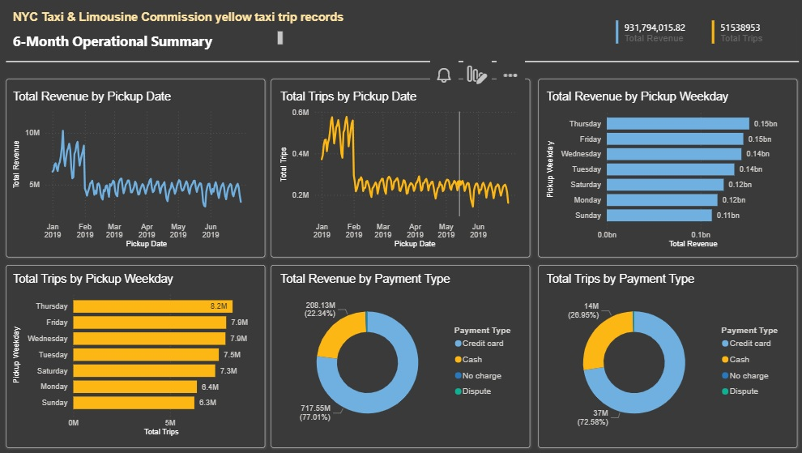
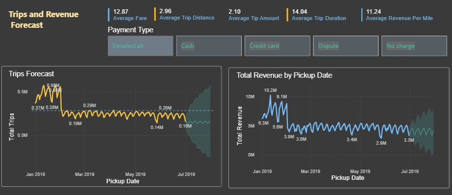

# Dashboard Summary and Business Insights

This document focuses only on the final Power BI dashboards. It explains the headline KPI figures, the meaning of the main charts, and the business interpretation of the final reporting output. It is intentionally shorter and more presentation-focused than the full project README and notebook.

## Dashboard Pages
The reporting output is organized into two dashboard pages:
- **6-Month Operational Summary**
- **Trips and Revenue Forecast**

## Dashboard Asset
[Open the exported dashboard PDF](./Quick%20summary%20NYC%20Taxi.pdf)

## Dashboard Screenshots
Add the final screenshots to a `screenshots/` folder in the repository and reference them here.

## Headline KPI Figures
- **Total Revenue:** 931,794,015.82
- **Total Trips:** 51,538,953
- **Average Fare:** 12.87
- **Average Trip Distance:** 2.96
- **Average Tip Amount:** 2.10
- **Average Trip Duration:** 14.04 minutes
- **Average Revenue Per Mile:** 11.24

## 1. Operational Summary
The overview page is designed to answer four practical questions:
- How much revenue was generated?
- How many trips were completed?
- When is performance strongest across the week and over time?
- How important are different payment methods?

### Total Revenue by Pickup Date
Revenue is strongest in the early portion of the selected 6-month period and then settles into a lower but relatively stable range. This suggests the business experienced a higher-demand opening period followed by a more consistent operating pattern.

### Total Trips by Pickup Date
Trip volume follows a similar shape. The early peak is followed by a lower but stable trend, which suggests that the business retains a consistent operating base even after the initial high-demand period ends.

### Total Revenue by Pickup Weekday
The highest revenue days are:
- **Thursday:** about 152M
- **Friday:** about 146M
- **Wednesday:** about 144M

The weakest revenue day is:
- **Sunday:** about 112M

This pattern suggests that weekday operations, especially late in the workweek, are more commercially important than weekend demand.

### Total Trips by Pickup Weekday
Trip counts show a similar ordering:
- **Thursday:** about 8.2M trips
- **Friday:** about 7.9M trips
- **Wednesday:** about 7.9M trips
- **Sunday:** about 6.3M trips

Because the weekday pattern for trips closely matches the weekday pattern for revenue, the business appears to be driven primarily by demand volume rather than by extreme shifts in average fare.

### Total Revenue by Payment Type
Revenue share is heavily concentrated in card-based transactions:
- **Credit card:** about 717.55M, roughly **77.01%**
- **Cash:** about 208.13M, roughly **22.34%**
- **No charge / Dispute:** very small share

### Total Trips by Payment Type
Trip volume shows a similar distribution:
- **Credit card:** about 37M trips, roughly **72.58%**
- **Cash:** about 14M trips, roughly **26.95%**
- **No charge / Dispute:** very small share

This confirms that credit card transactions dominate both demand volume and revenue generation.

## 2. Forecast Dashboard
The forecasting page is designed to support short-term directional planning rather than long-range prediction.

### Trips Forecast
The trips forecast suggests that trip demand is likely to continue around the recent lower operating range rather than returning to the earlier peak. The widening confidence interval shows that uncertainty increases quickly beyond the observed period.

### Revenue Forecast
Revenue forecasting shows a similar pattern. The model suggests short-term stabilization near the recent operating level, but the widening forecast band means the projection should be interpreted as directional rather than exact.

## Key Takeaways
- **Credit card payments dominate the business**, both in total trips and in total revenue.
- **Thursday and Friday are the strongest weekdays** for taxi activity and revenue generation.
- **Sunday is the weakest day** in both trip count and revenue.
- **The business shows an early peak followed by stabilization**, rather than a continuous decline.
- **Revenue and trip patterns move together**, suggesting that demand volume is the main driver of business performance in this period.
- **Forecasting supports short-term planning**, but the uncertainty band means it should be treated as guidance rather than certainty.

## Business Conclusion
From an operational perspective, the dashboard suggests that the taxi business in this 6-month window is driven by strong weekday demand, especially late in the workweek, and by a customer base that relies primarily on credit card payments. The pattern of stabilization after the initial peak indicates a mature and relatively steady operating environment. For decision-making, this means service readiness, capacity planning, and revenue monitoring should focus especially on midweek and late-week performance, while forecasting should be used for short-term directional insight rather than exact long-term prediction.

## Reference
This summary is based on the final dashboard outputs included in:
- `docs/Quick summary NYC Taxi.pdf`
