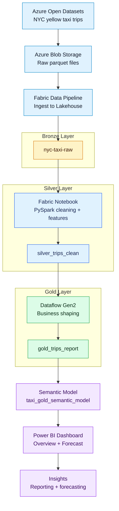

# NYC Yellow Taxi Analytics on Azure, Microsoft Fabric, and Power BI

## Project Summary
This project builds an end-to-end analytics workflow using **Azure Blob Storage**, **Microsoft Fabric**, **Lakehouse**, **PySpark Notebook**, **Dataflow Gen2**, **Power BI**, and **GitHub**.

The solution ingests **NYC Taxi & Limousine Commission yellow taxi trip records** from **Azure Open Datasets**, transforms the raw data into curated reporting layers, and delivers dashboard insights plus short-term forecasting.

The current project slice processes **6 months of 2019 data** and scales to **more than 52 million trip records**, making it a realistic large-data portfolio project rather than a toy sample.

## Dataset Source
The dataset comes from **Azure Open Datasets** and contains NYC yellow taxi trip records. Microsoft describes the dataset as including:
- pickup and dropoff timestamps
- pickup and dropoff locations
- trip distance
- itemized fare amounts
- payment type
- passenger count

Why this dataset is significant:
- It is large enough to demonstrate realistic data engineering and reporting workflows.
- It supports daily, weekly, and monthly trend analysis.
- It is suitable for KPI tracking, demand analysis, payment behavior analysis, and short-term forecasting.

## Why The Dataset Is Large
This dataset is large because each row represents a single taxi trip, and New York City generates an extremely high number of trips every day. When trip-level data is retained across multiple months, the number of rows grows quickly into the tens of millions.

That scale matters because it:
- reduces small-sample noise
- makes dashboard KPIs more credible
- supports stronger time-series analysis
- better reflects real-world reporting and engineering workloads

## Tools Used
- Azure Open Datasets
- Azure Blob Storage
- Microsoft Fabric Data Pipeline
- Microsoft Fabric Lakehouse
- Microsoft Fabric Notebook (PySpark)
- Microsoft Fabric Dataflow Gen2
- Power BI Semantic Model
- Power BI Dashboard and Forecasting
- GitHub

## Data Engineering Workflow
The project follows a Bronze -> Silver -> Gold architecture.



## Medallion Design
| Layer | Table | Purpose |
| --- | --- | --- |
| Bronze | `nyc-taxi-raw` | Raw ingested trip data from Azure Blob Storage |
| Silver | `silver_trips_clean` | Cleaned and standardized trip-level data with derived analytical features |
| Gold | `gold_trips_report` | Business-ready reporting table for Power BI |

## Transformation Summary
### Bronze
- Raw taxi parquet files copied into Azure Blob Storage
- Fabric pipeline ingests data into the Lakehouse

### Silver
Created in the notebook:
- standardized column names and types
- filtered invalid records
- created `pickup_date`, `pickup_month`, `pickup_hour`, `pickup_weekday`
- created `trip_duration_minutes`
- created `revenue_per_mile`

### Gold
Created in Dataflow Gen2:
- business-friendly reporting output
- cleaner display fields for Power BI
- final table used by semantic model and dashboards

## Dashboard Pages
### 1. Operational Summary
The overview dashboard focuses on:
- total revenue
- total trips
- revenue trend by date
- trip trend by date
- revenue by weekday
- trips by weekday
- revenue by payment type
- trips by payment type

### 2. Trips and Revenue Forecast
The forecasting page focuses on:
- short-term trip forecast
- short-term revenue forecast
- confidence band interpretation

## Key Insights
- **Credit card payments dominate** both total trip volume and total revenue, contributing roughly three quarters of activity.
- **Thursday and Friday are the strongest weekdays** for both trips and revenue, suggesting higher late-week demand.
- **Sunday is the weakest weekday** across both trip count and revenue.
- **Trip volume peaks early in the analysis period**, then stabilizes at a lower but consistent level over the remaining months.
- **Revenue remains relatively stable after the early peak**, which suggests the business normalizes after the initial high-demand period.
- **Forecasting suggests short-term stability**, but the widening confidence interval shows that the forecast should be interpreted as directional rather than exact.

## Forecasting Note
Forecasting in Power BI is based on the 6-month historical trend available in the Gold reporting layer. Because the project currently uses six months of data, the forecast is useful for short-term directional insight rather than long-term seasonal prediction.

## Challenges and Fixes
One important challenge in the project was ingestion quality:
- the first raw load brought in only a tiny subset of records
- the issue was traced to incomplete source files in Azure Blob Storage
- the ingestion process was corrected by loading complete monthly partition files
- the final dataset scaled to more than 52 million rows

This was an important part of the project because it demonstrated troubleshooting, validation, and data engineering quality control rather than only report building.

## Screenshots To Add
Add your final screenshots in this section or in a `screenshots/` folder:
- overview dashboard
- forecast dashboard
- Fabric pipeline
- Lakehouse tables
- notebook transformation steps

Example markdown after you add images:
```md


```

## Dashboard Summary
## GitHub Pages Dashboard
Once GitHub Pages is enabled for this repository, the project page can be viewed at:

```text
https://kagnaem.github.io/Azure-parquet-analytics-on-fabric/
```

The `docs/index.html` page now links to the exported PDF dashboard summary so visitors can open a stable version of the final report directly from GitHub Pages.

This project now includes an exported PDF dashboard summary so the reporting output remains accessible even if a live Power BI embed expires.

### Dashboard PDF
[View the dashboard summary PDF](docs/Quick%20summary%20NYC%20Taxi.pdf)

Why this approach is useful:
- the dashboard remains viewable directly from the repository
- the project does not depend on a live Fabric or Power BI trial
- GitHub visitors can quickly review the final reporting output alongside the notebook and README

## Repository Structure
```text
NYC_Taxi/
??? NYC_Taxi_Project.ipynb
??? README.md
??? docs/
    ??? index.html
```

## Portfolio Value
This project demonstrates:
- large-scale data ingestion
- layered data engineering design
- PySpark-based transformation
- reporting-ready semantic modeling
- Power BI dashboard design
- short-term forecasting
- GitHub-based project communication
